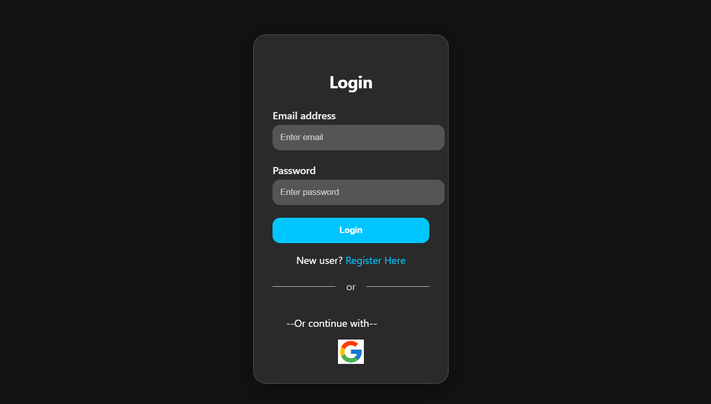
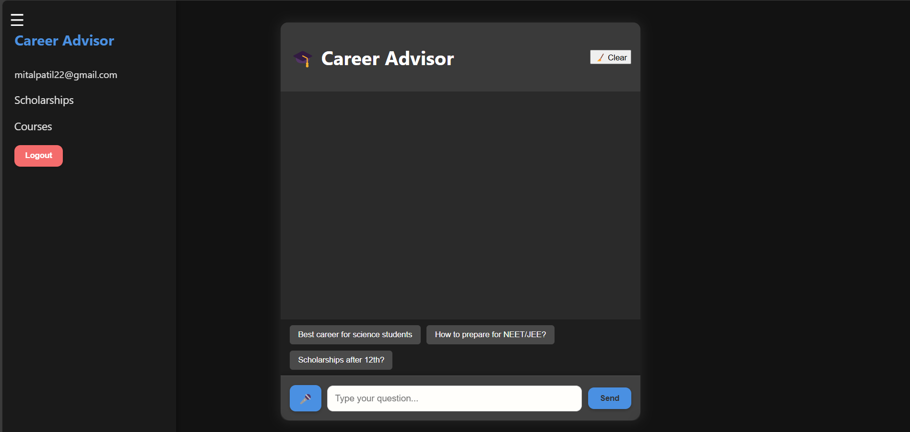

<h1 align="center">🎓 Career Advisor Chatbot</h1>

<p align="center">
  
  
  
</p>

> **"Confused about your future? Let AI show the way!"**

## 🧠 About the Project

Imagine having your own **AI Career Counselor** available 24/7 – that's what we built!

This Career Advisor Chatbot uses **Gemini API** to analyze your interests and goals, and suggests personalized:
- 💼 Career Paths
- 🧠 Skills to Build
- 📚 Courses to Learn

Built with ❤️ using **React.js** + **Firebase Auth**, it brings clarity to the chaos of career planning.

---

## ✨ Key Features

- 🤖 **AI Chatbot** – Get real-time guidance powered by Google Gemini API  
- 🔐 **User Auth** – Sign Up / Log In securely with Firebase  
- 🛤️ **Skill Pathways** – Curated skill-building suggestions  
- 📘 **Course Finder** – Recommended learning platforms  
- 🎨 Clean UI with smooth navigation and responsive design

---

## ⚙️ Tech Stack

| Tech         | Used For                |
|--------------|-------------------------|
| React.js     | Frontend Development    |
| Firebase     | User Authentication     |
| Gemini API   | Chatbot Intelligence    |
| React Router | Page Navigation         |
| CSS / Tailwind | Styling UI Components |

---

## 📸 Preview

<p align="center">
  
  &nbsp;
  
</p>

### 🧑‍🤝‍🧑 Collaborators

<table>
  <tr>
    <td align="center">
      <a href="https://github.com/17mital">
        <br />
        <sub><b>Mital Patil</b></sub>
      </a>
    </td>
    <td align="center">
      <a href="https://github.com/samikshaSuryawanshi1911">
        <br />
        <sub><b>Samiksha Suryawanshi</b></sub>
      </a>
    </td>
  </tr>
</table>


## 🚀 How to Run Locally

```bash
git clone https://github.com/your-username/career-advisor-chatbot.git
cd career-advisor-chatbot
npm install
npm start
